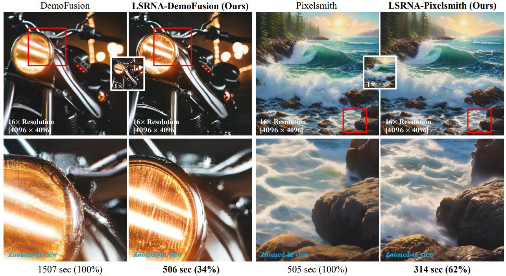
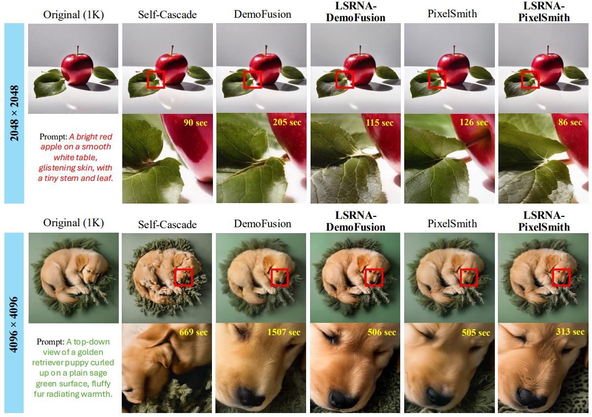

# LSRNA
[](https://3587jjh.github.io/LSRNA/)
[](https://arxiv.org/abs/2503.18446)

Official code for "Latent Space Super-Resolution for Higher-Resolution Image Generation with Diffusion Models".



<div align="justify">
<b>Abstract</b>: In this paper, we propose LSRNA, a novel framework for higher-resolution (exceeding 1K) image generation using diffusion models by leveraging super-resolution directly in the latent space. Existing diffusion models struggle with scaling beyond their training resolutions, often leading to structural distortions or content repetition. Reference-based methods address the issues by upsampling a low-resolution reference to guide higher-resolution generation. However, they face significant challenges: upsampling in latent space often causes manifold deviation, which degrades output quality. On the other hand, upsampling in RGB space tends to produce overly smoothed outputs. To overcome these limitations, LSRNA combines Latent space Super-Resolution (LSR) for manifold alignment and Region-wise Noise Addition (RNA) to enhance high-frequency details. Our extensive experiments demonstrate that integrating LSRNA outperforms state-of-the-art reference-based methods across various resolutions and metrics, while showing the critical role of latent space upsampling in preserving detail and sharpness.
</div> 

## Environment
```
conda create -n lsrna python=3.10
conda activate lsrna
pip install -r requirements.txt
```

## Text-to-Image Generation
> **Note:**  
> Although our LSRNA framework is designed to be compatible with any reference-based method,  
> this repo provides example code for LSRNA-DemoFusion, as DemoFusion is a pioneering reference-based approach.
```
CUDA_VISIBLE_DEVICES=0 python main.py \
    --prompt "A well-worn baseball glove and ball sitting on fresh-cut grass." \
    --negative_prompt "blurry, ugly, duplicate, poorly drawn, deformed, mosaic" \
    --height 2048 \
    --width 2048 \
    --seed 0 \
    --lsr_path "lsr/swinir-liif-latent-sdxl.pth" \
    --rna_min_std 0.0 \
    --rna_max_std 1.2 \
    --inversion_depth 30 \
    --save_dir "results" \
    #--low_vram
```
Feel free to adjust the RNA hyperparameters (e.g., --rna_max_std) to adjust the level of detail in the generated images. 
If you’re running out of VRAM, enable the low-VRAM mode with `--low_vram`.
We also provide a `run.sh` script for the generation.

## Visual Comparison


Additional results can be found on the [project page](https://3587jjh.github.io/LSRNA/).

## Citation
```
@article{jeong2025latent,
  title={Latent Space Super-Resolution for Higher-Resolution Image Generation with Diffusion Models},
  author={Jeong, Jinho and Han, Sangmin and Kim, Jinwoo and Kim, Seon Joo},
  journal={arXiv preprint arXiv:2503.18446},
  year={2025}
}
```

## Acknowledgement
This repo is based on [DemoFusion](https://github.com/PRIS-CV/DemoFusion) and [LIIF](https://github.com/yinboc/liif). 
